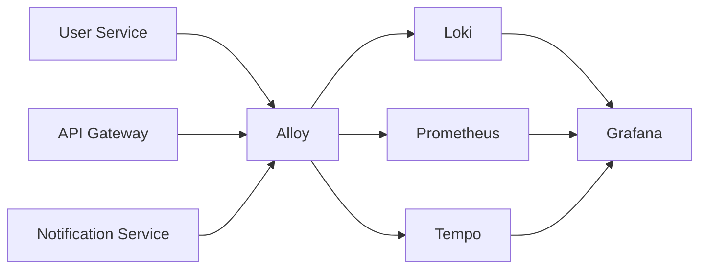
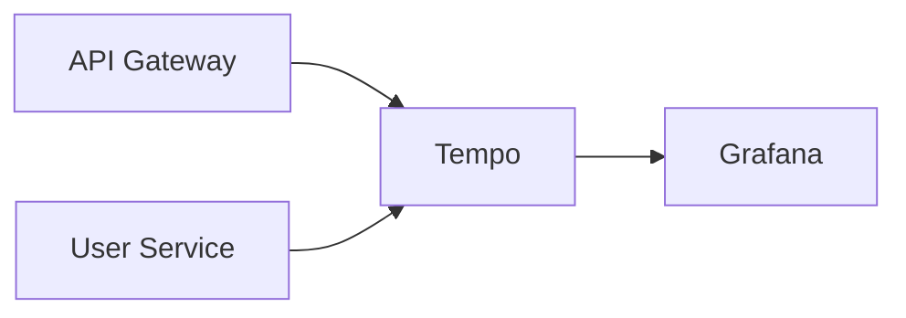

You are mixing up **collection**, **storage**, and **visualization**.

Think about your IRCTC system.

| Component     | Role               | Stores Data?   | Example                            |
| ------------- | ------------------ | -------------- | ---------------------------------- |
| Grafana       | UI / Dashboard     | ❌ No          | View traces, logs, metrics         |
| Tempo         | Trace database     | ✅ Yes         | Stores traceId, spans              |
| Loki          | Log database       | ✅ Yes         | Stores application logs            |
| Prometheus    | Metrics database   | ✅ Yes         | Stores CPU, memory, request counts |
| Grafana Alloy | Collector / Router | ❌ No (mostly) | Collects and forwards telemetry    |

Grafana Alloy is a collector that gathers logs, metrics, and traces and forwards them to backends such as Loki, Tempo, and Prometheus-compatible systems. ([Grafana Labs][1])

---

# Your Current Setup

Right now you have:

```text
User Request
     │
     ▼
API Gateway
     │
     ▼
User Service
     │
     ├── OpenTelemetry SDK
     │
     ▼
Tempo
     │
     ▼
Grafana
```

So:

```text
Trace
   generated by service
         ↓
       Tempo
         ↓
      Grafana
```

That is why you can already see traces.

You do **NOT** need Alloy for this path.

---

# Why Traces Work Without Alloy

Your services have:

```env
OTEL_EXPORTER_OTLP_ENDPOINT=http://irctc-tempo:4318
```

and

```bash
node --import @irctc/telemetry/instrumentation
```

So OpenTelemetry SDK sends spans directly to Tempo.

```text
Node App
   │
   ▼
OpenTelemetry SDK
   │
   ▼
Tempo
   │
   ▼
Grafana
```

No Alloy involved.

This is perfectly valid. ([Grafana Labs][2])

---

# Where Alloy Fits

Imagine you want logs.

Your service produces:

```json
{
  "service": "user-service",
  "message": "OTP sent"
}
```

Grafana cannot read Docker logs directly.

Something must collect them.

That collector is Alloy.

```text
Docker Logs
      │
      ▼
    Alloy
      │
      ▼
     Loki
      │
      ▼
   Grafana
```

Alloy reads logs and pushes them to Loki. ([Grafana Labs][1])

---

# Full LGTM Stack

LGTM =

| Letter | Component  |
| ------ | ---------- |
| L      | Loki       |
| G      | Grafana    |
| T      | Tempo      |
| M      | Prometheus |

Very common architecture:



---

# IRCTC Example

Suppose:

```text
POST /auth/send-otp
```

takes 3 seconds.

You want to investigate.

---

## Tempo (Traces)

Shows:

```text
api-gateway
   ↓
user-service
   ↓
postgres
```

You discover:

```text
pg.connect = 322ms
bcrypt = 500ms
Kafka publish = 100ms
```

Trace answers:

> "Where was the time spent?"

---

## Loki (Logs)

You search:

```logql
{service="user-service"}
```

and see:

```json
OTPRequestedV1 published
```

or

```json
Kafka publish failed
```

Logs answer:

> "What happened?"

---

## Prometheus (Metrics)

Shows:

```text
CPU = 90%
Memory = 2GB
Request Rate = 150/s
P95 Latency = 800ms
```

Metrics answer:

> "How healthy is the system?"

---

## Grafana

Combines everything.

```text
Trace
  ↓
Log
  ↓
Metric
```

on one screen.

Grafana stores almost nothing itself.

It queries Tempo, Loki, and Prometheus. ([Grafana Labs][2])

---

# What You Have Right Now



✅ Traces work

❌ Logs not centralized

❌ Metrics not collected

---

# What You Need Next

### Phase 1 (already done)

```text
OpenTelemetry
        ↓
      Tempo
        ↓
     Grafana
```

Distributed tracing.

---

### Phase 2

Add Loki:

```text
Docker Logs
      ↓
    Alloy
      ↓
     Loki
      ↓
   Grafana
```

Now you can search:

```logql
{service="user-service"}
```

---

### Phase 3

Add Prometheus:

```text
Prometheus
      ↓
   Grafana
```

Now you get:

- Request rate
- Error rate
- CPU
- Memory
- Kafka lag

---

### Phase 4

Correlate everything.

```text
Trace ID
   ↓
Tempo Trace
   ↓
Related Logs in Loki
   ↓
Related Metrics in Prometheus
```

This is the point where observability becomes extremely powerful for a production IRCTC-style system.

### One sentence summary

**Grafana = UI, Tempo = traces, Loki = logs, Prometheus = metrics, Alloy = collector/router that sends logs/metrics/traces to those storage systems.** Right now your traces are visible because your OpenTelemetry SDK is sending spans directly to Tempo, so Alloy and Loki are not required yet. ([Grafana Labs][1])

[1]: https://grafana.com/docs/alloy/latest/introduction/?utm_source=chatgpt.com "Introduction to Grafana Alloy | Grafana Alloy documentation"
[2]: https://grafana.com/docs/tempo/latest/operations/monitor/set-up-monitoring/?utm_source=chatgpt.com "Set up monitoring for Tempo | Grafana Tempo documentation"
