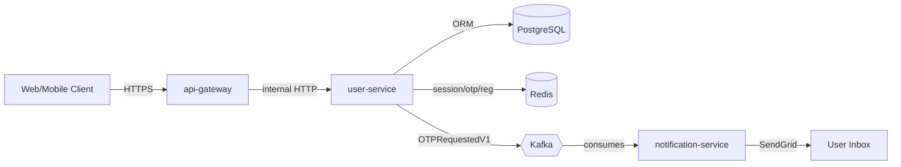
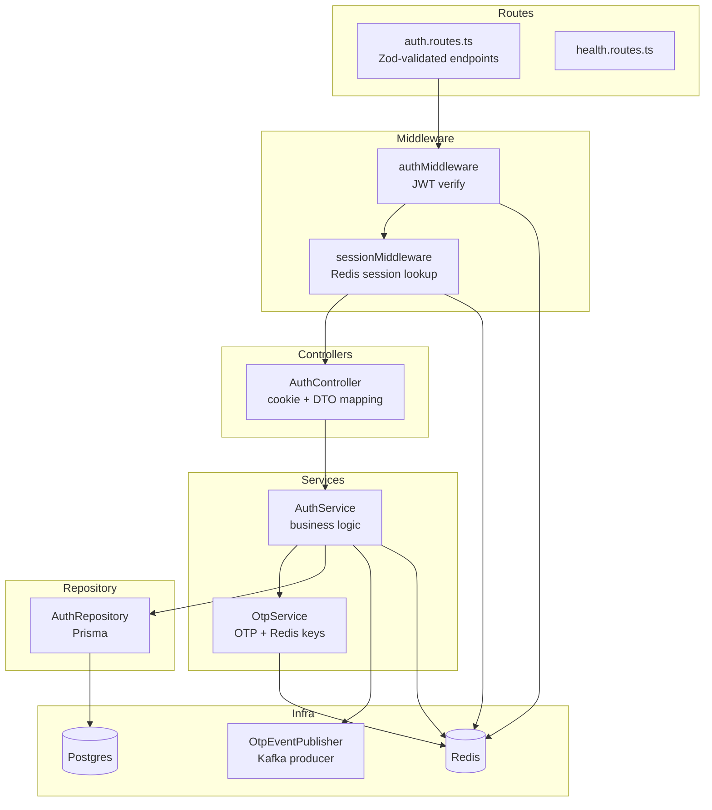
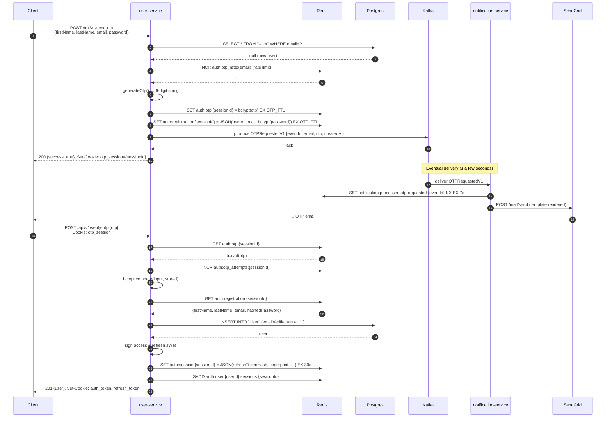
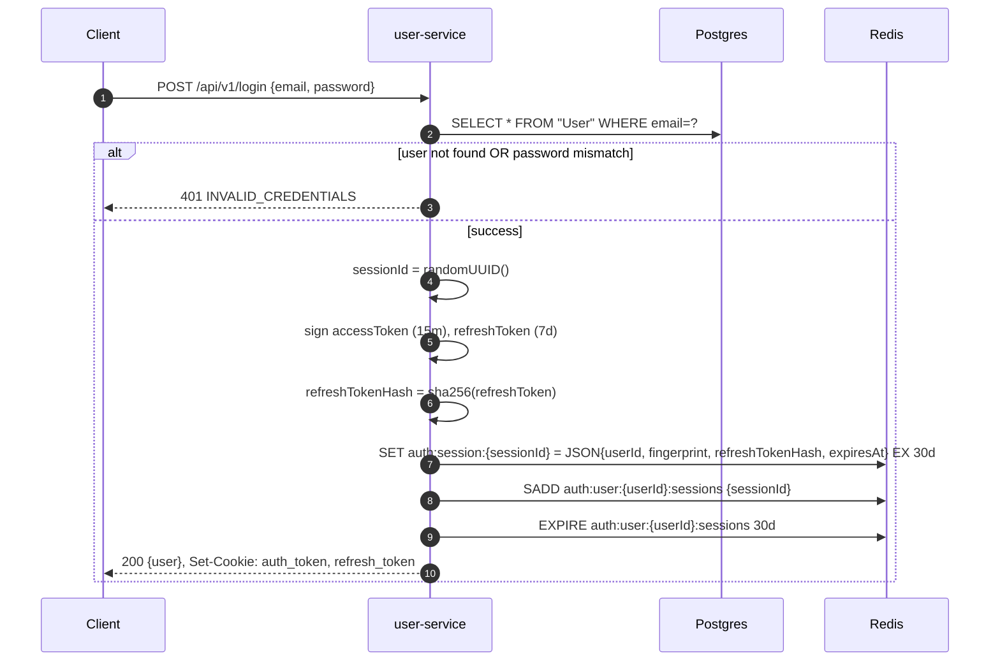
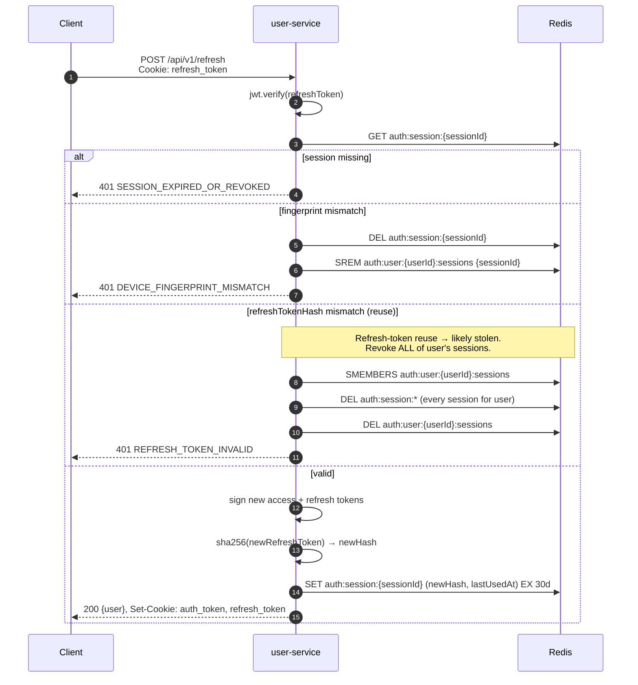
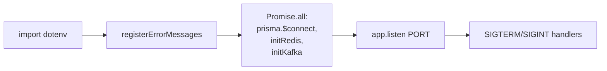
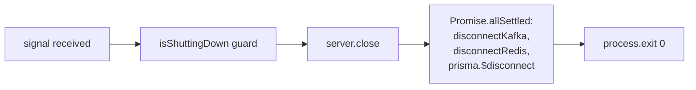

# `user-service`

> Authentication, session, and registration workhorse for the IRCTC platform.
> Owns the user record (Postgres), session state (Redis), and is the **producer** of
> `OTPRequestedV1` events on Kafka. It does **not** send email — that is
> `notification-service`'s job.

---

## Table of contents

1. [Responsibilities & non-responsibilities](#1-responsibilities--non-responsibilities)
2. [High-level architecture](#2-high-level-architecture)
3. [Component diagram](#3-component-diagram)
4. [Async registration flow (user-service ↔ notification-service)](#4-async-registration-flow-user-service--notification-service)
5. [Login flow](#5-login-flow)
6. [Token refresh & rotation](#6-token-refresh--rotation)
7. [Session management](#7-session-management)
8. [Redis data model — every key, why it exists, its TTL, and who owns it](#8-redis-data-model)
9. [Kafka contract — what we publish and why](#9-kafka-contract)
10. [API reference (every endpoint)](#10-api-reference)
11. [Security model](#11-security-model)
12. [Rate limits & abuse prevention](#12-rate-limits--abuse-prevention)
13. [Failure modes & rollback](#13-failure-modes--rollback)
14. [Startup, shutdown, and observability](#14-startup-shutdown-and-observability)
15. [Configuration reference](#15-configuration-reference)
16. [Local development](#16-local-development)

---

## 1. Responsibilities & non-responsibilities

### Owns

- User registration (with email verification via OTP).
- Login (email + password).
- Access/refresh token issuance, rotation, reuse detection.
- Multi-device session management.
- Rate-limiting the OTP endpoint.
- Persistence of the `User` row in Postgres (via Prisma).
- Session metadata in Redis.
- Producing the `OTPRequestedV1` event to Kafka.

### Does NOT own

- **Email delivery.** The service that _publishes_ the OTP request has no SMTP,
  SendGrid, or transport code. Email is `notification-service`'s concern.
- Token revocation lists beyond a single session. Refresh tokens are rotated, not
  globally blacklisted.
- Profile updates (the route is reserved; functionality is intentionally a
  no-op stub today).
- Authorization (what a logged-in user is _allowed_ to do) — that's enforced
  downstream by `api-gateway` and the resource services.

---

## 2. High-level architecture



`user-service` is the **only** service that writes to the `User` table and the
**only** service that knows the password hash. The Kafka event carries
no credentials — only the OTP the user already has in their inbox, which
they have to type into _user-service_ to complete registration. This means
`notification-service` can be compromised without leaking any password
material or impersonating a user.

---

## 3. Component diagram



Layered architecture following the rest of the IRCTC services: `Routes →
Controllers → Services → Repositories → Prisma/External`.

---

## 4. Async registration flow (user-service ↔ notification-service)

Registration is a two-request, cross-service flow. The client never talks to
`notification-service` directly — it just waits for the email and types the
OTP back into `user-service`.



### Why this design

- **No SMTP in user-service.** Email is a _side effect_ of an internal event;
  user-service returns as soon as the event is durably enqueued.
- **Rollback on Kafka failure.** If `producer.send` rejects _after_ Redis has
  accepted the OTP and registration session, we delete both keys and return
  `502 KAFKA_PUBLISH_FAILED`. The user is never told "OTP sent" if the event
  was not actually published. This is what makes the "OTP is in your inbox"
  contract truthful.
- **Two-stage session.** The `otp_session` cookie ties the _pending_
  registration to a browser. Once the OTP is verified, the _real_ session
  cookie (`auth_token` + `refresh_token`) is issued. There's no path that
  creates a `User` row without an OTP match.
- **Schema validation on the wire.** `notification-service` parses
  `OTPRequestedV1` with Zod (in `@irctc/contracts`). A future payload change
  requires a new topic and a new schema version, never a silent field
  rearrangement.

---

## 5. Login flow



The 30-day Redis TTL on the session **outlives** the 7-day refresh token TTL
on purpose — when a refresh token expires, the next login creates a new
session, but an active session may have its refresh token rotated multiple
times before its own TTL.

### Fingerprinting

`sessionMiddleware` and `AuthService.refresh` both compare the device
fingerprint embedded at login time against the one on the incoming request.
A mismatch (cookie stolen from a different IP/UA) is treated as a credential
theft signal: the session is killed and `DEVICE_FINGERPRINT_MISMATCH` is
returned.

---

## 6. Token refresh & rotation



### Refresh token rotation

Every successful refresh **issues a new refresh token** and updates the
stored hash. The old refresh token is implicitly invalid because the stored
hash no longer matches. This is the standard defence against
refresh-token theft.

### Reuse detection

If a refresh token _whose hash is not currently stored_ shows up, the
request is treated as a theft signal. We call `logoutAll(userId)` which
destroys every active session for the user across every device. The user
must log in again, which re-issues a fresh session. This is the standard
auth-industry practice (see OWASP "Refresh Token Rotation").

### Fingerprint

On every refresh, the device fingerprint must match what was stored at
login. Mismatch ⇒ the session is destroyed. Mismatch on refresh
(where the user _is_ presenting a valid refresh token) is a much stronger
theft signal than a generic "wrong password" — it's the legitimate token
being replayed from the wrong device.

---

## 7. Session management

| Endpoint                             | Auth required | Effect                                                                                                                                |
| ------------------------------------ | ------------- | ------------------------------------------------------------------------------------------------------------------------------------- |
| `GET /api/v1/sessions`               | yes           | List every active session for the current user (id, fingerprint, createdAt, lastUsedAt, expiresAt; **never** the refresh-token hash). |
| `DELETE /api/v1/sessions/:sessionId` | yes           | Revoke a specific session. Only the session's owner can revoke it; otherwise `403 SESSION_OWNERSHIP_INVALID`.                         |
| `POST /api/v1/logout`                | yes           | Destroy the current device's session (current `sessionId`). Clears both auth cookies.                                                 |
| `POST /api/v1/logout-all`            | yes           | Destroy every session for the current user. Use case: "I lost my phone".                                                              |

`GET /api/v1/me` returns the profile of the currently authenticated user.

### Why a Redis set per user?

A single user can have many concurrent sessions (phone + laptop + tablet).
We track them with `auth:user:{userId}:sessions` (Redis Set) so
`logoutAll` is one `SMEMBERS` + one `DEL` pipeline. The set's TTL is
refreshed on every authenticated request to outlive any single session.

---

## 8. Redis data model

`src/utils/constants/redis-keys.ts` is the single source of truth. All keys
are prefixed `auth:*` so ops can grep, scan, and ACL them as one bucket.

| Key pattern                     | Type                   | TTL                           | Set by                                              | Read by                                                           | Why it exists                                                                                                                                |
| ------------------------------- | ---------------------- | ----------------------------- | --------------------------------------------------- | ----------------------------------------------------------------- | -------------------------------------------------------------------------------------------------------------------------------------------- |
| `auth:otp_rate:{email}`         | `string` (int)         | 1 h sliding                   | `OtpService.storeOtp` (INCR + EXPIRE on first hit)  | `OtpService.storeOtp`                                             | Rate-limit: max 5 OTP-send requests per email per hour.                                                                                      |
| `auth:otp:{sessionId}`          | `string` (bcrypt hash) | `OTP_TTL` (default 5 min)     | `OtpService.storeOtp`                               | `OtpService.verifyOtp`                                            | The actual OTP, hashed so a Redis dump does not leak usable codes.                                                                           |
| `auth:otp_attempts:{sessionId}` | `string` (int)         | `OTP_TTL`                     | `OtpService.verifyOtp` (INCR + EXPIRE on first hit) | `OtpService.verifyOtp`                                            | Brute-force guard on the verify endpoint. After 5 wrong tries the OTP is deleted.                                                            |
| `auth:registration:{sessionId}` | `string` (JSON)        | `OTP_TTL`                     | `OtpService.storeRegistrationSession`               | `OtpService.getRegistrationSession` / `deleteRegistrationSession` | Holds the form data (name, email, **hashed** password) between `/send-otp` and `/verify-otp`.                                                |
| `auth:session:{sessionId}`      | `string` (JSON)        | 30 d                          | `AuthService.login` / `refresh`                     | `AuthService.refresh` / `sessionMiddleware`                       | Server-side session: userId, fingerprint, `sha256(refreshToken)`, timestamps. The refresh-token hash is what makes reuse detection possible. |
| `auth:user:{userId}:sessions`   | `set` of `sessionId`   | refreshed to 30 d on each use | `AuthService.login` (SADD)                          | `AuthService.getSessions` / `logoutAll` / `revokeSession` (SREM)  | Index of all active sessions for a user. Enables multi-device listing and "log out everywhere".                                              |
| `auth:blacklist:{tokenId}`      | `string`               | n/a                           | reserved                                            | reserved                                                          | Reserved for future global revocation. Not used today.                                                                                       |

> **Why bcrypt for the OTP, not the password?**
> Passwords are hashed with `bcryptjs` cost 10 at registration and live in
> Postgres. The OTP is hashed the same way (cost 10) but lives in Redis with
> a 5-minute TTL. We don't _need_ cost 10 for a 5-minute code, but using
> the same primitive means a future "store OTP in the same DB" migration
> needs no logic change.

### TTL summary

```mermaid
gantt
    title  Redis key lifetimes
    dateFormat  X
    axisFormat %s
    section OTP flow (5 min)
    auth:otp_rate:{email}    :a1, 0, 3600
    auth:otp:{sessionId}     :a2, 0, 300
    auth:otp_attempts:{sid}  :a3, 0, 300
    auth:registration:{sid}  :a4, 0, 300
    section Long-lived session (30 d)
    auth:session:{sessionId} :b1, 0, 2592000
    auth:user:{userId}:sess  :b2, 0, 2592000
```



---

## 9. Kafka contract

### Published events

| Topic                           | Schema                                 | Producer            | Consumer               | Purpose                                 |
| ------------------------------- | -------------------------------------- | ------------------- | ---------------------- | --------------------------------------- |
| `notification.otp-requested.v1` | `OTPRequestedV1` in `@irctc/contracts` | `OtpEventPublisher` | `notification-service` | Tell the email pipeline to send an OTP. |

### `OTPRequestedV1` payload

```ts
{
  eventId: string,   // uuid v4 — used for idempotency on the consumer
  userId?: string,   // uuid v4 — present on resends (not used in v1)
  email: string,     // recipient
  otp: string,       // 6-digit string
  createdAt: Date,   // z.coerce.date() — ISO 8601 on the wire, Date in memory
}
```

Headers:

| Header             | Value                                                |
| ------------------ | ---------------------------------------------------- |
| `x-event-id`       | the same `eventId` as the body (for log correlation) |
| `x-schema-version` | `"1"` (constant)                                     |

The publisher (`src/kafka/producer/otp-requested.publisher.ts`) sets
`allowAutoTopicCreation: false` and uses the same producer manager
in `@irctc/kafka` as every other service.

### Why a UUID for `eventId`?

`notification-service` uses `eventId` as the Redis key for exactly-once
processing: `SET notification:processed:otp-requested:{eventId} NX EX 7d`.
If Kafka redelivers the message (consumer rebalance, crash mid-handle), the
SET fails, the consumer short-circuits, and no second email is sent. The
7-day TTL is longer than any plausible redelivery window.

---

## 10. API reference

All endpoints live under `/api/v1`. All responses follow the
`@irctc/http` `successResponse` / `errorResponse` shape:

```json
{ "success": true,  "message": "...", "data": { ... } }
{ "success": false, "message": "...", "error": { "code": "...", "details": ... } }
```

Errors are normalised through `@irctc/errors` and carry a `code` from
`src/utils/errors/errorCodes.ts`.

### Public (unauthenticated)

| Method | Path          | Body                                                        | Success                                                                        | Errors                                                                                                                                         |
| ------ | ------------- | ----------------------------------------------------------- | ------------------------------------------------------------------------------ | ---------------------------------------------------------------------------------------------------------------------------------------------- |
| `POST` | `/send-otp`   | `RegisterRequestDto` (firstName, lastName, email, password) | `200 {success:true}` and `Set-Cookie: otp_session={sessionId}`                 | `409 USER_ALREADY_EXISTS`, `429 RATE_LIMIT_EXCEEDED`, `502 KAFKA_PUBLISH_FAILED`, validation                                                   |
| `POST` | `/verify-otp` | `VerifyOtpRequestDto` (otp) — `otp_session` cookie required | `201 {user}` and `Set-Cookie: auth_token, refresh_token`; clears `otp_session` | `400 OTP_INVALID`, `404 OTP_EXPIRED`/`OTP_SESSION_NOT_FOUND`/`REGISTRATION_SESSION_EXPIRED`, `429 OTP_LOCKED`                                  |
| `POST` | `/login`      | `LoginRequestDto` (email, password)                         | `200 {user}` and `Set-Cookie: auth_token, refresh_token`                       | `401 INVALID_CREDENTIALS`                                                                                                                      |
| `POST` | `/refresh`    | empty body, `refresh_token` cookie required                 | `200 {user}` and rotated `Set-Cookie: auth_token, refresh_token`               | `401 REFRESH_TOKEN_MISSING` / `REFRESH_TOKEN_INVALID` / `INVALID_REFRESH_TOKEN` / `DEVICE_FINGERPRINT_MISMATCH` / `SESSION_EXPIRED_OR_REVOKED` |

### Authenticated (require `auth_token` cookie)

| Method   | Path                   | Body / params          | Success                                                                                            | Errors                                                              |
| -------- | ---------------------- | ---------------------- | -------------------------------------------------------------------------------------------------- | ------------------------------------------------------------------- |
| `GET`    | `/me`                  | —                      | `200 {user}`                                                                                       | `401 *` (middleware), `404 USER_NOT_FOUND`                          |
| `POST`   | `/logout`              | `refresh_token` cookie | `200` + clears both auth cookies                                                                   | `401 REFRESH_TOKEN_MISSING` / `REFRESH_TOKEN_INVALID`               |
| `POST`   | `/logout-all`          | `refresh_token` cookie | `200` + clears both auth cookies                                                                   | `401 *`                                                             |
| `GET`    | `/sessions`            | —                      | `200 [ {sessionId, fingerprint, createdAt, lastUsedAt, expiresAt} ]` (refresh-token hash stripped) | `401 *`                                                             |
| `DELETE` | `/sessions/:sessionId` | —                      | `200`                                                                                              | `400 SESSION_ID_REQUIRED`, `403 SESSION_OWNERSHIP_INVALID`, `401 *` |

### Health

| Method | Path            | Notes                                                                                 |
| ------ | --------------- | ------------------------------------------------------------------------------------- |
| `GET`  | `/health/live`  | Process liveness. Always 200 if the event loop is up.                                 |
| `GET`  | `/health/ready` | 200 only when Postgres, Redis, and the Kafka producer are all healthy; 503 otherwise. |

### Cookie contract

| Cookie          | Value             | Attributes                                                                                         |
| --------------- | ----------------- | -------------------------------------------------------------------------------------------------- |
| `auth_token`    | JWT access token  | `HttpOnly`, `SameSite=Strict`, `Secure` in prod, lifetime = `JWT_ACCESS_EXPIRES_IN` (default 15 m) |
| `refresh_token` | JWT refresh token | `HttpOnly`, `SameSite=Strict`, `Secure` in prod, lifetime = `JWT_REFRESH_EXPIRES_IN` (default 7 d) |
| `otp_session`   | UUID session id   | `HttpOnly`, `SameSite=Strict`, lifetime = `OTP_TTL` (default 5 m)                                  |

The `Secure` flag is set only when `NODE_ENV=production`. The `SameSite=Strict`
choice means cross-site form posts cannot carry these cookies; we do not
support OAuth-style cross-site callbacks.

---

## 11. Security model

- **Passwords** are stored as `bcryptjs(password, 10)` hashes in Postgres.
  Login compares with `bcrypt.compare`. Constant-time by construction.
- **OTPs** are also `bcryptjs(otp, 10)` so a Redis dump does not leak
  usable codes within the 5-minute window.
- **Refresh tokens** are stored as `sha256(token)` in Redis. The raw token
  is only ever in the user's cookie. Reuse detection works because the
  server compares hashes, never the raw token.
- **JWTs** are signed with `JWT_SECRET` (HS256 by default). The access
  token's `type` claim is enforced (`"access"`); refresh tokens carry
  `type: "refresh"`. `authMiddleware` rejects a refresh token used as an
  access token.
- **Device fingerprint** is computed from `User-Agent` + the first IP in
  `X-Forwarded-For` (configurable) and embedded in the session record.
  Mismatch on `/refresh` ⇒ session killed; mismatch on a fresh login
  attempt would simply be a different session.
- **Helmet** sets the usual security headers. CORS is locked to
  `CORS_ORIGINS` (comma-separated, env-driven).
- **Request size limit** is 1 MB (`express.json({ limit: "1mb" })`).
- **Cookies** are `HttpOnly` + `SameSite=Strict`; `Secure` in production.
- **Centralised error codes.** `ApiError` carries a code from
  `errorCodes.ts`; the global error handler normalises to a stable
  response shape. No internal stack traces ever reach the client.

### Threat model — what we _don't_ defend

- A compromised `notification-service` can spam OTPs but cannot authenticate
  as a user.
- A Redis dump leaks OTP _hashes_ (bcrypt, 5-min window) and refresh-token
  _hashes_ (sha256, 30-day window) but no plaintext credentials.
- A Postgres dump leaks bcrypt password hashes (cost 10).

---

## 12. Rate limits & abuse prevention

| Limit                             | Window            | Key                             | Enforced where                                                                      |
| --------------------------------- | ----------------- | ------------------------------- | ----------------------------------------------------------------------------------- |
| 5 OTP-send requests per email     | 1 h sliding       | `auth:otp_rate:{email}`         | `OtpService.storeOtp` (INCR + EXPIRE)                                               |
| 5 OTP-verify attempts per session | `OTP_TTL` (5 min) | `auth:otp_attempts:{sessionId}` | `OtpService.verifyOtp` — at limit, OTP is **deleted** and `429 OTP_LOCKED` returned |

These are per-key limits, not per-IP. A real production deployment should
add a per-IP rate limit at the API gateway (e.g. `api-gateway` with Redis
token bucket) — that is _not_ user-service's job.

---

## 13. Failure modes & rollback

### Kafka publish fails after Redis writes

The OTP and registration session have been written, but the user will
never receive an email. `AuthService.sendOtp` calls
`OtpService.deleteRegistrationSession(sessionId)` (which also deletes
`auth:otp:{sessionId}`) and returns `502 KAFKA_PUBLISH_FAILED`. The
client should surface "please try again" and the user can re-submit
`send-otp` cleanly.

### `notification-service` is down

`OTPRequestedV1` events accumulate in Kafka. `notification-service`'s
consumer is in its own consumer group; when it comes back it replays from
the last committed offset. The consumer's idempotency store
(`notification:processed:otp-requested:{eventId}`) means re-deliveries
do not double-send. The OTP itself expires after `OTP_TTL` in Redis, so
there is a natural cutoff.

### Redis is down

- Login, `/me`, `/sessions`, `/logout*` — all fail fast (Redis client
  raises on `connect`).
- The `/health/ready` probe returns 503; Kubernetes re-routes traffic.
- The `kafkajs` producer is unaffected.

### Postgres is down

- `/send-otp` fails at the duplicate-email check.
- `/verify-otp` fails at the `INSERT INTO "User"`.
- `/login` fails at the user lookup.

We do **not** cache users in Redis — the password comparison is always
done against the canonical record.

### Graceful shutdown

`server.ts` follows the IRCTC-wide order:

1. Stop accepting HTTP (`server.close`).
2. Disconnect Kafka producer.
3. Disconnect Redis.
4. Disconnect Prisma.

SIGTERM and SIGINT both trigger this. `unhandledRejection` and
`uncaughtException` also route through shutdown.

---

## 14. Startup, shutdown, and observability

### Startup sequence (parallelised where possible)



Boot fails fast if any of Prisma/Redis/Kafka is not ready — the service
never accepts traffic with a broken dependency.

### Shutdown sequence



`Promise.allSettled` is used so that a single failed disconnect does not
skip the others; K8s will see all teardown steps attempted.

### Logging & tracing

- `@irctc/logger` (Pino) is used everywhere. Modules are tagged
  (`{ module: "auth" }`, `{ module: "otp" }`, etc.) for filtering in Loki.
- Every request gets a `requestId` (from `@irctc/middleware`) and is logged
  on entry and exit.
- The OpenTelemetry `traceparent` header is forwarded through CORS but
  the service does **not** start its own spans (telemetry is intentionally
  deferred for now).

### Health endpoints

- `GET /health/live` — process is up.
- `GET /health/ready` — Postgres, Redis, Kafka producer all healthy.

K8s readiness probe uses `/health/ready`; liveness uses `/health/live`.

---

## 15. Configuration reference

All env vars are validated by `@t3-oss/env-core` at boot; missing or
malformed values abort startup with a clear error message.

| Var                      | Required | Default                             | Purpose                                                               |
| ------------------------ | -------- | ----------------------------------- | --------------------------------------------------------------------- |
| `PORT`                   | no       | `4001`                              | HTTP port.                                                            |
| `NODE_ENV`               | no       | `development`                       | `development` / `production` / `test`. Controls cookie `Secure` flag. |
| `DATABASE_URL`           | **yes**  | —                                   | Prisma Postgres connection string.                                    |
| `REDIS_URL`              | **yes**  | —                                   | `redis://` or `rediss://`. Validated at boot.                         |
| `CORS_ORIGINS`           | no       | `http://localhost:3000`             | Comma-separated allow-list.                                           |
| `JWT_SECRET`             | **yes**  | —                                   | HS256 signing key. Min length 1.                                      |
| `JWT_ACCESS_EXPIRES_IN`  | no       | `15m`                               | Access-token lifetime.                                                |
| `JWT_REFRESH_EXPIRES_IN` | no       | `7d`                                | Refresh-token lifetime.                                               |
| `OTP_TTL`                | no       | `300` (5 min)                       | TTL for `auth:otp:*` and `auth:registration:*` keys.                  |
| `SERVICE_NAME`           | no       | `user-service`                      | Tag for logs.                                                         |
| `KAFKA_BROKERS`          | no       | `localhost:9092`                    | Comma-separated broker list.                                          |
| `KAFKA_CLIENT_ID`        | no       | `user-service`                      | Producer client id.                                                   |
| `KAFKA_OTP_TOPIC`        | no       | `notification.otp-requested.v1`     | Target topic for OTP events.                                          |
| `KAFKA_OTP_DLQ_TOPIC`    | no       | `notification.otp-requested.v1.dlq` | Reserved for future DLQ writer.                                       |

SendGrid, OTEL, Loki, and `BASE_URL` / `PUBLIC_URL` were intentionally
removed: mail is `notification-service`'s concern, and tracing/observability
env wiring is deferred.

---

## 16. Local development

### Prerequisites

- Node 20+
- pnpm 9+
- A running Postgres (Neon, local Docker, etc.)
- A running Redis (local Docker is fine)
- A running Kafka broker (e.g. `docker run -p 9092:9092 apache/kafka`)
- A `notification-service` running (or use `pnpm --filter notification-service dev`)

### One-time setup

```bash
pnpm install
pnpm --filter user-service prisma generate
pnpm --filter user-service prisma migrate dev
cp apps/user-service/.env.example apps/user-service/.env   # then fill in DATABASE_URL, REDIS_URL, JWT_SECRET
```

### Run

```bash
pnpm --filter user-service dev
# server listening at http://localhost:4001 (development)
```

### Smoke test

```bash
# 1. Request an OTP
curl -i -X POST http://localhost:4001/api/v1/send-otp \
  -H "Content-Type: application/json" \
  -c /tmp/cookies.txt \
  -d '{"firstName":"Ada","lastName":"Lovelace","email":"ada@example.com","password":"correcthorsebatterystaple"}'

# 2. Inspect your email (or the SendGrid dashboard) for the 6-digit code
# 3. Verify
curl -i -X POST http://localhost:4001/api/v1/verify-otp \
  -H "Content-Type: application/json" \
  -b /tmp/cookies.txt -c /tmp/cookies.txt \
  -d '{"otp":"123456"}'

# 4. Call a protected route
curl -i http://localhost:4001/api/v1/me -b /tmp/cookies.txt
```

### Build

```bash
pnpm --filter user-service build       # tsc + tsc-alias
pnpm --filter user-service type-check  # tsc --noEmit
```

---

## See also

- `packages/contracts` — versioned event schemas (Zod).
- `packages/kafka` — producer/consumer plumbing shared by every service.
- `apps/notification-service` — the consumer of `OTPRequestedV1`.
- Root `CLAUDE.md` — high-level architecture and the IRCTC-wide service
  pattern.
